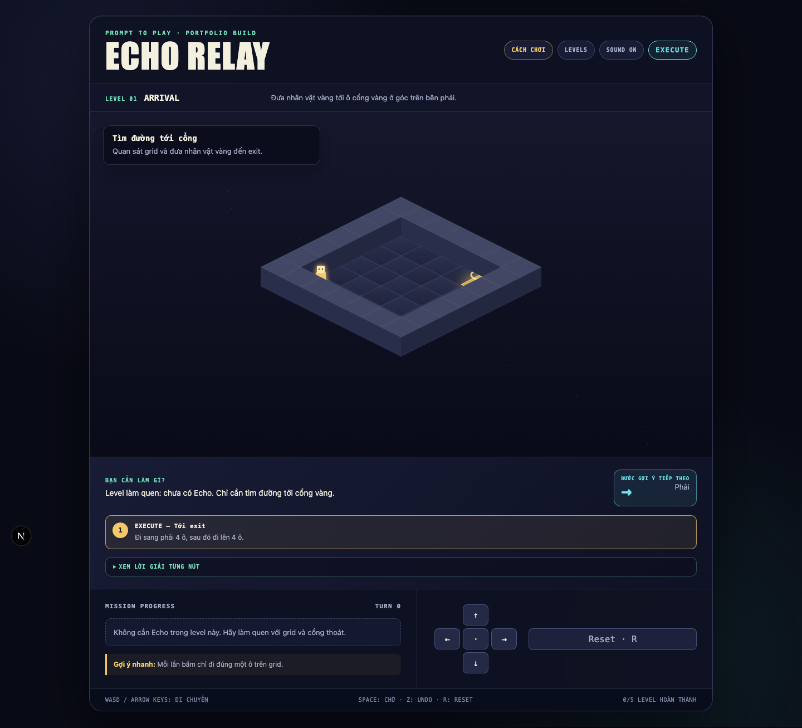
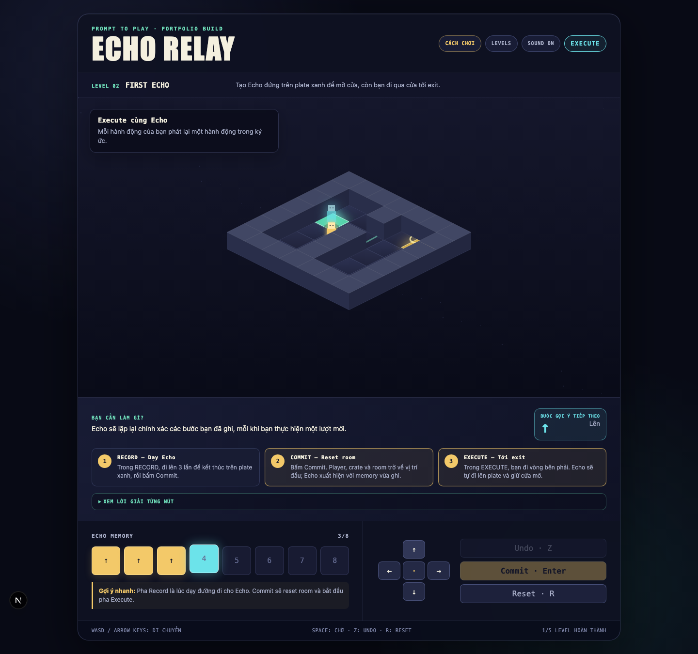
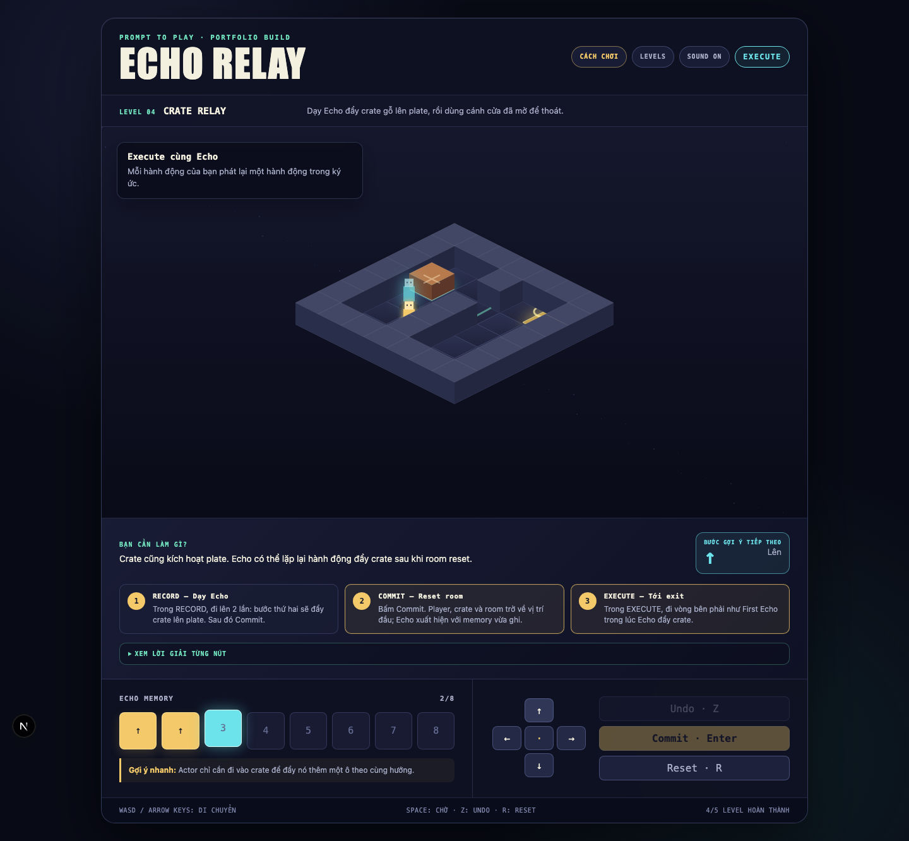

# Echo Relay

**Echo Relay** là puzzle game web dạng pixel/isometric được xây dựng cho portfolio **Prompt To Play 2026**.

Người chơi ghi lại một chuỗi hành động, Commit để reset room và tạo một **Echo** lặp lại chính xác chuỗi đó. Player phải phối hợp với Echo để giữ pressure plate, mở cửa, đẩy crate, tắt laser và đến exit.

## Preview







Raw gameplay capture: `submission/demo/echo-relay-raw-demo.webm`

## Playable scope

Bản hiện tại có 5 level hoàn chỉnh:

1. **Arrival** — grid movement và exit.
2. **First Echo** — record, commit và pressure plate.
3. **Sync Window** — timing và hành động `WAIT`.
4. **Crate Relay** — Echo đẩy crate lên plate.
5. **Laser Crossing** — Echo giữ plate để vô hiệu hóa laser.

Game lưu tiến trình và trạng thái âm thanh bằng `localStorage`. Gameplay không cần backend, tài khoản hoặc API key.

## Controls

| Hành động | Phím |
|---|---|
| Di chuyển | `WASD` hoặc phím mũi tên |
| Chờ một lượt | `Space` |
| Commit recording | `Enter` |
| Undo khi Record | `Z` |
| Reset level | `R` |
| Mở level select | `Escape` |

Game cũng có controls bằng nút trên màn hình cho thiết bị cảm ứng.

## Run locally

Yêu cầu Node.js 22+ và pnpm 10+.

```bash
pnpm install
pnpm dev
```

Mở `http://localhost:3999`.

`pnpm dev` và `pnpm start` sẽ tự dừng process đang chiếm port `3999` trước khi khởi động server mới.

## Quality checks

```bash
pnpm test
pnpm typecheck
pnpm lint
pnpm build
pnpm test:e2e
pnpm capture:assets
```

`capture:assets` tạo lại 6 screenshot và raw demo video trong thư mục `submission/`.

## Architecture

```text
app/                    Next.js App Router entry và global UI
components/game/        React shell, HUD và level selection
game/core/              deterministic puzzle engine thuần TypeScript
game/levels/            level data
game/render/            Canvas 2D isometric renderer
game/audio/             synthesized Web Audio feedback
e2e/                    browser smoke tests
```

Nguyên tắc chính:

- Engine không import React, Canvas hoặc DOM.
- Một input và một state luôn sinh ra cùng kết quả.
- Level được định nghĩa bằng dữ liệu.
- Renderer chỉ đọc state để vẽ.
- Gameplay hoạt động hoàn toàn offline sau khi tải trang.

## Technology

- Next.js 16
- React 19
- TypeScript
- Canvas 2D
- Web Audio API
- Vitest
- Playwright

## Original work and reference material

Game chính tại root repository được viết mới. Thư mục `test/` được `.gitignore` loại khỏi source submission và chỉ chứa template tham chiếu cục bộ. Sản phẩm không sử dụng Shopify, Liveblocks, cart, checkout hoặc chat moderation.

Isometric projection sử dụng công thức grid-to-screen tiêu chuẩn. Gameplay engine, level data, UI, renderer hiện tại và test suite thuộc dự án Echo Relay.

## Privacy

Game không thu thập dữ liệu cá nhân và không gửi gameplay state tới server. Tiến trình chỉ được lưu cục bộ trong trình duyệt.

## Submission checklist

- [x] Playable trên desktop browser
- [x] 5 level có lời giải được kiểm thử
- [x] Tutorial và hint trong game
- [x] Record, Echo replay, crate, door, plate và laser
- [x] Win/fail, retry, level select và lưu tiến trình
- [x] Responsive controls
- [x] Unit test, typecheck, lint và production build
- [ ] Deploy public URL
- [ ] Quay video demo 60–90 giây
- [x] Chụp 6 screenshot gameplay tự động
- [ ] Điền thông tin tác giả và portfolio links

## License

Source code của Echo Relay được phát hành theo MIT License. Asset hoặc template tham chiếu nằm ngoài root submission không thuộc phạm vi license này.
